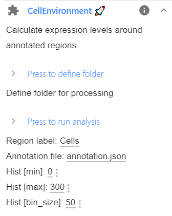

# Cell environment

In this workflow, expression levels are measured in equi-distant zones around user-defined regions, e.g. cells.

As input the workflow requires:

* **FISH-quant**  results file: positions of RNAs.
* **ImJoy** annotation files: positions of cells.

## Summary of analysis workflow

For each RNA, the distance to every regions is calculated and the RNA is assigned
to the closest region.

The user also defines the spacing of equi-distant zones around each region. 
For each region, the number of RNAs for each zone is computed. Additionally, 
the number of pixels in each zone, i.e. it's area is calculated. If required, this
can be used to normalized the RNA counts, i.e. to to correct for the large size of regions
that are are further away.

## Required tools

### FISH-quant for RNA detection

For more information, Please visit the dedicated section [**here**](rna-detection.md).

### ImJoy Plugins

These plugins have to be installed only once, after installation they will be
available in the dedicated ImJoy workspace: **`liver-rna-loc`**

When pressing on the links below, ImJoy will open in your browser (best in Chrome) and
you will be asked to confirm the installation with a dialog as shown below. 
After confirmation, the plugin and additional auxiliary plugins will be installed.

* `ImageAnnotator`: annotate your images.
<a href="https://imjoy.io/#/app?w=liver-rna-loc&plugin=oeway/ImJoy-Plugins:ImageAnnotator&upgrade=1" target="_blank">**Install from here.**</a>

* `CellEnvironment`: calculate expression gradient. <a href="https://imjoy.io/#/app?w=liver-rna-loc&plugin=muellerflorian/walesky-rna-loc-liver:CellEnvironment@stable&upgrade=1" target="_blank">**Install from here.**</a> Alternatively, you can also use the provided Jupyter notebook.

</img>

### Jupyter notebook

To perform the calculation of the expression gradients, we also provide a Jupyter notebook `cell_environment.ipynb`, which can be found on GitHub in the folder [`notebooks`](https://github.com/muellerflorian/walesky-rna-loc-liver/tree/master/notebooks).

## Data

### Data organisation

This workflow permits batch-processing of a large number of files, but requires a strict data-organization

1. Top folder called `acquisition`.
2. A subfolder for each experimental condition, i.e. `cond_1` for the example data.
3. Each sample (usually a field of view) is in a separate folder, e.g. named `sample_1`, `sample_2`, ... .Each sample folder can contain images of multiple channels.
4. FQ result files are in the same folder. A folder can contain **multiple FQ results** for different channels.
5. An annotation file with the outlines cells (ending with `annotation.json`). See below
    for more details.

In the example below, a folder contains the annotations (`annotation.json`),
two different channels (`...green.tif`,  `...red.tif`, `...blue.tif` ), the FQ outline file (`...outline.txt`), the FQ results
for the red channels `...spots.txt`, and an annotation file (`annotation.json`).

Please note that you can have **only one annotation file per sample folder**. You
can create it by visualizing any of the channels, but the same annotations will be used
for each FQ results file in this folder.

```
├─ data__cell_environment/
│  ├─ acquisition
│  │  ├─ cond_1
│  │  │  ├─ sample_1
│  │  │  │  ├─ sample_1_annotation.json
│  │  │  │  ├─ sample_1_red_spots.txt
│  │  │  │  ├─ sample_1_red_outline.txt
│  │  │  │  ├─ sample_1_green.tif
│  │  │  │  ├─ sample_1_red.tif
│  │  │  │  ├─ sample_1_blue.tif
│  │  │  ├─ sample_2
│  │  │  ├─ ...
│  │  ├─ cond_1
│  │  │  ├─ sample_1
│  │  │  ├─ ...
│  ├─ analysis
│  │  ├─ cond_1
│  │  │  ├─ sample_1
│  │  │  │  ├─ analysis__cell_env
│  │  │  │  │  ├─ sample_1_red_spots
│  │  │  │  │  │  ├─ histogram__PIX.csv
│  │  │  │  │  │  ├─ histogram__RNA.csv
│  │  │  │  │  │  ├─ histogram__RNA_norm.csv
│  │  │  │  │  │  ├─ per_region
│  │  │  │  │  │  │  ├─ hist__reg_0.png
│  │  │  │  │  │  │  ├─ ...
│  │  │  │  │  │  │  ├─ histogram__reg_0.csv
│  │  │  │  │  │  │  ├─ ...
│  │  ├─ ...

```

### Demo data

You can find already processed demo data
<a href="https://www.dropbox.com/s/9uwu8ea7119a1mq/data__cell_environment.zip?dl=0" target="_blank">**here.**</a>

The outline cells are macrophages, and have the label `Mac`.

TODO: upon publication, demo data will be moved to Zenodo.

## Analysis workflow

### 1. RNA detection with FQ

For more details, please consult the dedicated section [**here**](rna-detection.md).

### 2. Annotation of cells

For this workflow, all cells that should be analyze have to be manually annotated in ImJoy with one annotation
type. We recommend naming this annotation `Cells`, but other names can be used as well (but you have
to update the default value in the analysis scripts as described below).

For more details, please consult the dedicated section [**here**](imjoy-annotation.md).

### 3. Calculate density profiles

You can run this analysis either with the dedicated ImJoy plugin or the provided Jupyter notebook.
In either case, you need to have a local installation of Python. For more information consult the 
dedicated section [**here**](tools-imjoy.md).

### 4. Location to store results

The results will be saved in a dedicated folder `analysis__cell_env`. Here, a dedicated folder 
for each spot detection result will be created and named with the name of the FQ results file. 

Different options exist to define where this folder will be created: 

1. You can define an **absolute path name**. This path will be used to store the data. 
2. You can define a **replacement operation** where parts of the path name of the results, will be
   replaced with another string. This is convenient when wanting to store the results in a different location than the raw data. Such a replacement operation is specified with a string where the `old_string` is separated by the `new_string` with a `>>`, e.g. the string `acquisition>>analysis` indicates that not a complete path is provided, but that a string in the provided data folder will be replaced. More specifically, the string `acquisition` will be replaced by `analysis`. 

#### Analysis in ImJoy

If you use **Imjoy**, you need to install the **Jupyter engine**. 
The first installation might take a bit of time, since the necessary Python environments
on the plugin engine are created.

Once installed, you will see in the plugin sidebar, where you can launch the analysis:

{: style="width:300px"}

1. Paste the full name of the folder that should be processed. This folder will be recursively searched
    and each subfolder containing an annotation file will be processed. 

2. If needed, change the analysis parameters (see Table below), and press on plugin name in blue to launch 
    the analysis,

    Option            | Type | Default           | Description
    ------------------|------|-------------------|-----------------------------------------------------------------
    `Path DATA`       | str  |                   | Full path to folder that should be scanned for annotation files.
    `PATH Save`       | str  |                   | Where results should be saved (see above).
    `Region label`    | str  | `Cells`           | Label of the annotated regions.
    `Annotation file` | str  | `annotation.json` | Name of the ImJoy annotation file.
    `Hist [min]`      | int  | 0                 | Minimum value of histogram to summarize enrichment (in pixel).
    `Hist [max]`      | int  | 300               | Maximum value of histogram to summarize enrichment (in pixel).
    `Hist [bin]`      | int  | 50                | Bin size (in pixel).

3. The plugin will then analyse all sample folders containing an annotation file. 
   Progress can be monitored in the plugin log, accessible via the `i` next to the plugin name.

**Progress is reported** in the plugin log (accessible with the 'i' symbol
next to the plugin name) and the ImJoy progress bar.

#### With Jupyter notebook

Once you have your conda environment installed as described in the Overview section,
you can open the Jupyter notebook (`cell_environment.ipynb`, which can be found on 
GitHub in the folder `notebooks`.

You have to execute the first cell to import the analysis package.

The second cell allows you to

1. Define the folder containing your data.
2. Defining the parameters described above for the analysis. 

Executing the cell, will launch the analysis workflow as described above.

### 4. Generated result files

The function will create a number of result files, which are stored in the
subfolder `analysis__cell_env`. For each FQ result file, a separate subfolder 
with name of this file is created. In this folder the different histograms are 
summarized:

*  **`histogram__PIX.csv`**. Contains PIXEL histograms for all regions, e.g. 
    number of pixels in the defined equi-distant zones around the regions. 
    These values are used for renormalization. First column is the center of histogram bin (in pixel).

* **`histogram__RNA.csv`**. Contains RNA counts per equi-distant zone for all regions.

* **`histogram__RNA_norm.csv`**. Contains renormalized RNA counts per equi-distant 
    zone for all regions.

In this folder, results for **each region** are stored
Results files have the full name of the FQ file with the following prefixes

* **`histogram__reg_i.csv`**, histograms for region `i`. 
    Contains the spatial expression gradient as a table:

    * 1st col: center of histogram bins (in pixel).
    * 2nd col: RNA counts
    * 3rd col: Pixel counts
    * 4th col: Normalize counts.

* **`histogram_summary__reg_i.png`**, summary image of for region `i`. First row shows
    smFISH image, mask of region, distance transform (distance from region). Second row 
    shows the raw histograms for RNAs and pixels, as well as the renormalized histogram. 
