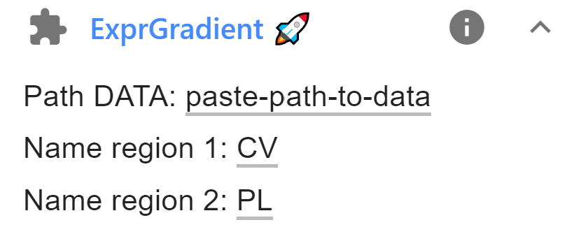

# Expression gradient analysis
In this workflow, the spatial expression gradient between two reference regions
are created. The distances are renormalised such that results from different images
can be more easily be compared.

As input the workflow requires:

-   **FISH-quant**  results file: created with FISH-quant.
-   **ImJoy** annotation files: annotations of the two reference regions.

## Summary of analysis workflow

The expression gradient is calculated as follows

1.  In the analysis, the distance for RNA from the first reference region is calculated
    (the shortest distance between the RNA and the polygon defining this region). Negative
    distances mean that the RNA is inside, positive that the RNA is outside.
2.  These distances are then renormalised with the shortest distance between the center of mass
    of the second region and the polygon of the first region.
     </img>

3.  Distances are then summarised in histograms with bins of width 0.1 between the minimum
    and maximum renormalised distance measurements.
4.  These counts are then further renormalised to consider the actual contained area
    in the image for a given distance. This is done by calculating the distance transform of the image
    with respect to region 1. These values are treated distance measurements, and treated as
    described for the RNA distance measurements. The obtained histogram counts are used
    to normalise the RNA distance counts.
5.  Lastly, the histogram is such that frequencies sum up to 1.

## Required tools

### ImJoy Plugins
These plugins have to be installed only once, after installation they will be
available in the dedicated ImJoy workspace: **`liver-rna-loc`**

Pressing on the links below, will open ImJoy in your browser (best in Chrome) and
allow you to install the required plugins. You will be asked to confirm the installation
with a dialog as shown below. After confirmation, the plugins will be installed together with
additional auxiliary plugins.

* `ImageAnnotator`: annotate your images.
<a href="https://imjoy.io/#/app?w=liver-rna-loc&plugin=oeway/ImJoy-Plugins:ImageAnnotator&upgrade=1" target="_blank">**Install from here.**</a>

* `ExpGradient`: calculate expression gradient. <a href="https://imjoy.io/#/app?w=liver-rna-loc&plugin=muellerflorian/walesky-rna-loc-liver:ExprGradient@stable&upgrade=1" target="_blank">**Install from here.**</a>

</img>

### Jupyter notebook
To perform the calculation of the expression gradients, we also provide a 
Jupyter notebook `expression_gradient.ipynb`, which can be found on GitHub
in the folder [`notebooks`](https://github.com/muellerflorian/walesky-rna-loc-liver/tree/master/notebooks).

## Data

### Data organisation

This workflow requires that data is organised in the following away

1.  A parental folder contains all sample folders, e.g. `data__expression_gradient` for the example data.
0.  Each sample (usually a field of view) is in a separate folder, e.g. named `sample_1`, `sample_2`, ....       Each sample folder can contain images of multiple channels.
0.  FQ result file are in the same folder. A folder can contain FQ results for different channels.
0.  An annotation file with the two reference regions (`annotation.json`). See below
    for more details.


In the example below, a folder contains the annotations (`annotation.json`),
two different channels (`...(green).tif` and `...(red).tif` ), the FQ results
for both channels `....txt`, and an annotation file (`annotation.json`).

Please note that you can have **only one annotation file per sample folder**. You
can generate it based on any of the channels, but the same annnotations will be used
for each FQ results file in this folder.

```
├─ data__expression_gradient/
│  ├─ sample_1
│  │  ├─ annotation.json
│  │  ├─ sample_1_green_outline_spots_181018.txt
│  │  ├─ sample_1_green.tif
│  │  ├─ sample_1_red_outline_spots_181017.txt
│  │  ├─ sample_1_red.tif
│  ├─ sample_2
│  │  ├─ ...
```

### Demo data
You can find already processed demo data
<a href="https://www.dropbox.com/s/bwsel68dqlhq66d/data__expression_gradient.zip?dl=0" target="_blank">**here.**</a>

TODO: upon publication, demo data will be moved to Zenodo.

## Analysis

### 1. RNA detection with FQ
Please consult the dedicated section [**here**](rna-detection.md) for more details.

### 2. Annotation of reference regions
Please consult the dedicated section [**here**](imjoy-annotation.md) for more details.

For this workflow, you need TWO different annotations

1.  **Central vein**, we recommend naming it `CV`.
2.  **Portal lobe**, we recommend naming it `PL`.


### 3. Calculate density profiles
You can run this analysis either with the provided code in the Jupyter notebook,
or use ImJoy.

#### Analysis in ImJoy
If you use **ImJoy**, you need to install the **Python plugin engine**. 
The first installation might take a bit of time, since the necessary Python environments
are created.

Once installed, you will see in the the plugin in the sidebar. Before using it, you have 
to specify the labels of the two reference regions. To access the plugin parameters, press
on the arrow down symbol next to the plugin name.

In the example below the labels `CV` and `PL` are defined for the first and second
region, respectively.


{: style="width:300px"}

Then you can press on the plugin name to execute the plugin. In a dialog, you will
be asked to specify a folder, please select the parental folder containing the different
sample folders. The plugin will then analyse all sample folders containing an
annotation file. The regions in this file will then be used to establish the spatial
expression gradient between these two regions.

**Progress is reported** in the plugin log (accessible with the 'i' symbol
next to the plugin name) and the ImJoy progress bar.

#### With Jupyter notebook
Once you have your conda environment installed as described in the Overview section,
you can open the Jupyter notebook and analyze your data. You have to execute the first cell
to load the necessary code.

The second cell allows you to

1.  Define the folder containing your data.
2.  Defining the labels for the two annotated reference regions.

Executing the cell, will launch the analysis workflow. described above.

### 4. Generated result files

The function will create a number of result files, which are stored in the
subfolder `analysis__exprGradient`.
Results files have the full name of the FQ file with the following prefixes

-   **_summary_density** (PNG file). Contains plots of expression density plots.
    Cells are filled with pixel values corresponding to their expression level.

-   **_summary_gradient** (PNG file). Contains summary plots for the spatial gradients
    between two the two reference points (the first plot shown on this page).

-   **hist_expression** (tab delimited text file). Contains the spatial expression
    gradient as a table:

    -   1st col: normalised distance,
    -   2nd col: normalised counts by number of pixels (4th col)
    -   3rd col: RNA counts
    -   4th col: number of pixels in the image within range (for normalisation)

-   **img_density** (16bit tif file). Contains the expression density plots. The pixel
    value of the cell corresponds to the number of RNAs in this cell. No outlines are
    shown. Files can be rendered with Fiji and an adequate look-up table.

-   **img_density_outline** (16 bit tif file). Contains the expression density plot
    and the cell outlines. The outlines of the cells are set to the maximum RNA count
    in the image. This guarantees that the outlines can be seen.

-   **img_outline** (8 bit image). Outlines of all cells in the image.
